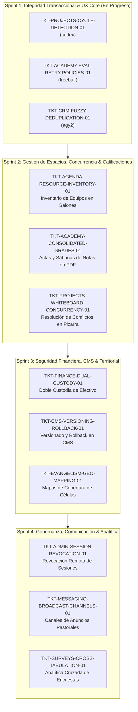

# Diagnóstico Integral de la Plataforma CCF y Matriz de Faltantes Módulo por Módulo
**Fecha de Diagnóstico:** 2026-10-06  
**Auditor Principal:** `agy` (Equipo de Arquitectura e Integración Canónica CCF)  
**Alcance:** 10 Módulos de Negocio + Capa Transversal (Frontend, Backend, Base de Datos y QA)

---

## 1. Resumen Ejecutivo

La plataforma **CCF** ha consolidado su núcleo transaccional, con 248 tablas PostgreSQL, 1,695 endpoints registrados en FastAPI y una interfaz moderna en Next.js 15. Los tres axiomas canónicos de arquitectura se encuentran formalmente validados:
1. **Axioma 1 (Kernel de Personas):** Identidad humana unificada y canónica en `personas.id` (150 FKs directas, sin duplicación de entidades personales en submódulos).
2. **Axioma 2 (UTC y Soft-Deletes):** Eliminación total de `datetime.utcnow()`, uso estricto de `datetime.now(timezone.utc)` y 122 tablas con `deleted_at`.
3. **Axioma 3 (Aislamiento Multi-Tenant):** 72 tablas con `sede_id`, resolución desde token JWT (`get_user_sede_id()`) y prevención de suplantación cross-sede.

No obstante, un diagnóstico exhaustivo funcional y operativo evidencia **deuda técnica, flujos incompletos y brechas funcionales de alta prioridad (P0/P1)** requeridas para que cada módulo opere a nivel de excelencia y escala en producción.

---

## 2. Diagnóstico Detallado Módulo por Módulo

### 2.1. Módulo: Academia (`academy`)
* **Estado Actual:** 130 endpoints en API; modelos de cursos, lecciones, módulos, cohortes, evaluaciones, inscripciones, certificados y vista docente/estudiante.
* **Faltantes Críticos y Oportunidades de Mejora:**
  1. **Políticas de Reintento y Enfriamiento (Cooldown) en Evaluaciones [P0]:** Actualmente no se restringe el tiempo mínimo entre reintentos tras reprobar un examen ni se bloquea tras $N$ intentos fallidos, permitiendo adivinación por fuerza bruta.
  2. **Persistencia de Progreso de Video Multidispositivo [P0]:** Al reproducir lecciones audiovisuales, no se registran heartbeats en backend (`last_position_seconds`), impidiendo reanudar la lección exactamente donde se pausó si se cambia de dispositivo.
  3. **Generación Masiva de Sábanas de Notas y Actas de Cohorte [P1]:** Falta exportador consolidado (PDF/Excel) por cohorte con promedios ponderados y validación de firmas digitales de facilitadores.
  4. **Rúbricas de Evaluación Multidimensional [P2]:** En entregas de tareas abiertas, el docente solo asigna una nota numérica sin criterios analíticos ni descriptores cualitativos.

---

### 2.2. Módulo: Proyectos (`projects`)
* **Estado Actual:** 119 operaciones registradas; vistas de Tabla, Lista, Calendario, Kanban, Gantt, Insumos, Indicadores de Valor SPI y constructor de automatizaciones.
* **Faltantes Críticos y Oportunidades de Mejora:**
  1. **Prevención de Ciclos y Deadlocks en Grafo de Tareas [P0]:** Al crear o editar dependencias en Gantt, no se evalúa la presencia de dependencias circulares (A $\to$ B $\to$ C $\to$ A), provocando cuelgues en el cálculo de la ruta crítica.
  2. **Validación de Fechas de Tareas vs. Límites de Fase [P0]:** Las tareas pueden definirse con fechas que exceden o anteceden el rango temporal asignado a su fase en el proyecto.
  3. **Resolución de Conflictos en Pizarra (Whiteboard) en Tiempo Real [P1]:** La edición colaborativa carece de control de concurrencia optimista / locking visual de nodos cuando dos usuarios editan el mismo elemento.
  4. **Persistencia y Tendencia Histórica de Valor Ganado (EVM) [P1]:** Los indicadores SPI/CPI se calculan en memoria en el cliente; falta almacenar snapshots semanales en base de datos para análisis de curvas de tendencia temporal.

---

### 2.3. Módulo: CRM & Consejería Pastoral (`crm`)
* **Estado Actual:** 175 endpoints; gestión de prospectos y miembros, pipelines de etapas, banco de recursos, consejería pastoral confidencial con cifrado simétrico E2EE.
* **Faltantes Críticos y Oportunidades de Mejora:**
  1. **Motor de Deduplicación Difusa (Fuzzy Matching) [P0]:** Al ingresar o importar personas, no se realiza búsqueda fonética ni por trigramas (`pg_trgm`) en nombres y teléfonos, generando registros duplicados en el Kernel de Personas.
  2. **Línea de Tiempo 360° Integral de la Persona [P1]:** La vista de persona muestra datos aislados; falta un feed cronológico unificado que consolide notas pastorales, asistencias a grupos, cursos de academia y peticiones de oración.
  3. **Disparadores de Alerta por Inactividad Pastoral (SLA) [P1]:** Falta un daemon/scheduler que identifique personas sin contacto pastoral por más de 30/60 días y las mueva automáticamente a etapas de retención/alerta.
  4. **Bitácora Inmutable de Descifrado de Consejería [P2]:** Aunque las notas están cifradas, debe auditarse quién, desde qué IP y en qué fecha/hora descifró una nota confidencial.

---

### 2.4. Módulo: Agenda & Salones / Espacios (`agenda`)
* **Estado Actual:** 22 endpoints; gestión de eventos, recurrencia RFC 5545 RRULE, bloqueo estricto de colisiones físicas de salones por horario y sede.
* **Faltantes Críticos y Oportunidades de Mejora:**
  1. **Inventario y Asignación de Recursos Físicos Limitados [P1]:** El sistema bloquea el salón, pero no los recursos compartidos (consolas de audio, proyectores, microfonía, sillas adicionales), provocando solapamientos de equipamiento.
  2. **Sincronización Bidireccional iCalendar (.ics) [P1]:** Falta endpoint seguro con token para suscribir la agenda pastoral en Google Calendar, Apple Calendar o Microsoft Outlook.
  3. **Eventos Multisede e Híbridos [P2]:** Falta soporte estructurado para eventos que ocurren simultáneamente en múltiples sedes con transmisión en vivo y salas de enlace virtual.

---

### 2.5. Módulo: Evangelismo & Grupos de Conexión (`evangelism`)
* **Estado Actual:** 77 endpoints; campañas masivas, pre-inscripciones, escáner QR con sincronización diferida offline, grupos celulares y rankings.
* **Faltantes Críticos y Oportunidades de Mejora:**
  1. **Geolocalización y Visualización Cartográfica de Grupos [P1]:** Falta mapa interactivo (Leaflet/MapLibre) con capas de calor para visualizar la cobertura geográfica y radios de influencia de los grupos por sede.
  2. **Asignación Espacial Automática de Nuevos Convertidos [P1]:** Función en backend para sugerir el grupo de conexión más cercano al domicilio o coordenadas de una persona recién convertida.
  3. **Funnel Longitudinal de Retención (12 Semanas) [P1]:** Tablero analítico que mida semana a semana la permanencia de nuevos convertidos desde el evento masivo hasta su bautismo y discipulado.

---

### 2.6. Módulo: CMS & Sitios Públicos (`cms` / `cms_v2`)
* **Estado Actual:** 237 endpoints; Puck Editor, renderizado de páginas dinámicas, revalidación ISR en demanda, OpenGraph dinámico, blogs y portales públicos.
* **Faltantes Críticos y Oportunidades de Mejora:**
  1. **Versionado Histórico de Contenido y Rollback en 1 Clic [P1]:** Falta tabla de snapshots de páginas publicadas para permitir revertir cambios accidentales con previsualización diferencial (diff visual).
  2. **Biblioteca de Medios con Carpetas y Formatos Modernos [P1]:** Los activos en SeaweedFS requieren organización en carpetas lógicas, alt text obligatorio y derivación responsiva (`<picture>` con WebP/AVIF y `srcset`).
  3. **Constructor de Formularios con Protección Anti-Spam [P1]:** Los formularios públicos carecen de integración criptográfica Honeypot o Cloudflare Turnstile/reCAPTCHA, exponiendo endpoints públicos a envíos masivos automatizados.

---

### 2.7. Módulo: Finanzas & Tesorería (`finances` / `finance_suite`)
* **Estado Actual:** 50 endpoints; presupuesto por sede, flujo de aprobación multinivel de gastos, fondos de caja menor, rechazo categórico de pasarelas de pago comerciales.
* **Faltantes Críticos y Oportunidades de Mejora:**
  1. **Conciliación Bancaria por Extractos (OFX / CSV) [P1]:** Falta interfaz y parser para contrastar transacciones bancarias contra los pagos y transferencias internas registradas.
  2. **Protocolo de Recaudación en Efectivo con Doble Custodia (Dual Custody) [P1]:** Registro de sobres de ofrendas/diezmos con requerimiento obligatorio de dos firmas de testigos (tesorero + pastor/líder) antes de consolidar el ingreso.
  3. **Alertas Preventivas de Sobregiro Presupuestario en Tiempo Real [P1]:** Bloqueo en el flujo de aprobación cuando una solicitud de gasto supere el saldo restante asignado a ese centro de costo en el mes en curso.

---

### 2.8. Módulo: Mensajería & Notificaciones (`messages` / `messaging`)
* **Estado Actual:** Chat interno, canales, menciones `@`, WebSockets y notificaciones push web nativas mediante estándar VAPID.
* **Faltantes Críticos y Oportunidades de Mejora:**
  1. **Canales de Anuncios Unidireccionales (Broadcast) [P1]:** Permisos diferenciados donde solo pastores/administradores publican y los usuarios solo leen y reaccionan.
  2. **Resumen Periódico por Correo (Email Digest) [P2]:** Envío diario o semanal a usuarios inactivos con las menciones y tareas pendientes no atendidas.
  3. **Previsualización Enriquecida de Enlaces (Link Unfurling) [P2]:** Generación automática de tarjeta de preview con metadata OpenGraph para URLs compartidas en el chat.

---

### 2.9. Módulo: Administración, Seguridad & Gobernanza (`admin`)
* **Estado Actual:** 44 endpoints; RBAC granular con permisos canónicos, gestión de sedes, autenticación de dos factores TOTP RFC 6238.
* **Faltantes Críticos y Oportunidades de Mejora:**
  1. **Panel de Control de Sesiones Activas y Revocación Remota [P1]:** Visualización de dispositivos conectados (IP, navegador, fecha de inicio) con botón de cierre de sesión forzado.
  2. **Delegación Temporal de Roles y Suplencias [P1]:** Asignación de permisos con fecha de caducidad automática (`valid_until`), ideal para vacaciones pastorales o licencias ministeriales.
  3. **Bitácora Centralizada de Auditoría Forense (SIEM Log) [P2]:** Registro de eventos críticos (cambios de roles, 2FA, modificaciones de sede) exportable en formato estándar.

---

### 2.10. Módulo: Encuestas & Formularios (`surveys`)
* **Estado Actual:** 10 endpoints; creación de formularios, lógica condicional de bifurcación de preguntas, renderizador público responsive.
* **Faltantes Críticos y Oportunidades de Mejora:**
  1. **Motor de Tabulación Analítica Cruzada [P1]:** Visualización gráfica automática de respuestas con filtros demográficos y exportación a Excel/CSV.
  2. **Control de Duplicidad y Cuotas de Respuesta [P2]:** Límite configurable de envíos por persona, IP o período de tiempo para prevenir sesgos en encuestas de satisfacción.

---

### 2.11. Capa Transversal: Infraestructura, DevOps & Testing
* **Estado Actual:** Contenedores Docker Compose para Postgres, Redis, SeaweedFS, Backend y Frontend; scripts de build y deploy zero-downtime.
* **Faltantes Críticos y Oportunidades de Mejora:**
  1. **Cobertura Unificada de Vitest en `src/app` [P1]:** La configuración actual de coverage en frontend solo mide `src/design` y `src/components`, dejando fuera las páginas y layouts de rutas.
  2. **Rate Limiting Granular en Endpoints Públicos [P1]:** Proteger los endpoints bajo `/api/public/*` contra abusos mediante límites de tasa basados en IP y Fingerprint.
  3. **Dashboard de Métricas de Salud del Sistema (Observabilidad) [P2]:** Exponer métricas de rendimiento y latencia p95/p99 a través de endpoint `/metrics` compatible con Prometheus.

---

## 3. Estado en el Puente CCF (Primer Bloque Asignado)

Para iniciar la ejecución operativa del plan sin violar las políticas de concurrencia del puente (`scripts/ccf_agent_bridge.py`), se han registrado y asignado los tres primeros tickets **P0** a los agentes desarrolladores:

| Ticket ID | Módulo | Agente | Worktree Asignado | Alcance |
| :--- | :---: | :---: | :--- | :--- |
| **`TKT-PROJECTS-CYCLE-DETECTION-01`** | `projects` | `codex` | `/root/ccf` | Detección de dependencias circulares en tareas (DAG) y validación de límites temporales de fase |
| **`TKT-ACADEMY-EVAL-RETRY-POLICIES-01`** | `academy` | `freebuff` | `/root/ccf-freebuff-academy-superpro` | Políticas de reintentos con enfriamiento y persistencia de posición de video en lecciones |
| **`TKT-CRM-FUZZY-DEDUPLICATION-01`** | `crm` | `agy2` | `/root/ccf-crm-completion` | Motor de búsqueda difusa con trigramas para deduplicación de personas y timeline 360° |

---

## 4. Plan de Trabajo Propuesto por Sprints

