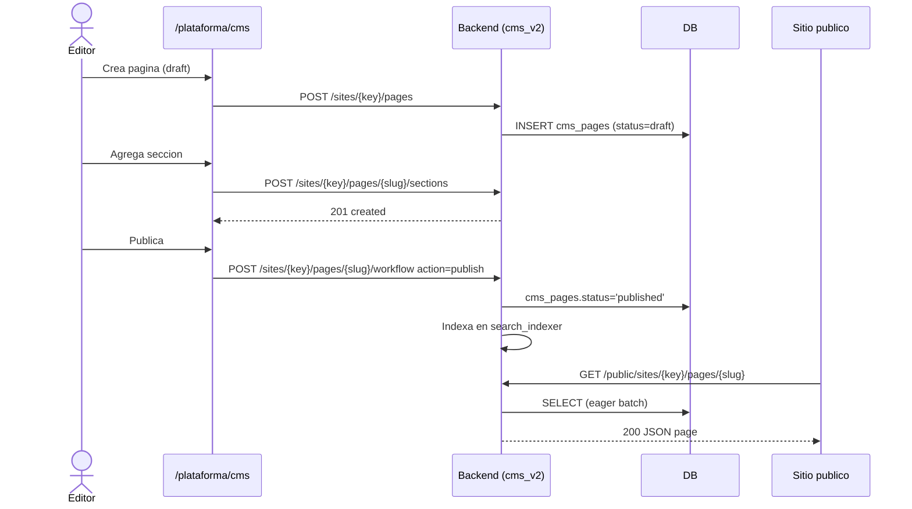

# CMS Architecture (post-refactor Fase 4)

> Diagrama visual de la arquitectura del módulo CMS v2 tras el refactor de la Fase 4 (split del monolito `backend/api/cms_v2.py` en paquete `backend/api/cms_v2/` y `backend/api/cms/`).
> Documento complementario a `docs/ARQUITECTURA_CMS.md`, centrado en flujo y despliegue.

---

## 1. Diagrama de alto nivel

```mermaid
flowchart LR
    subgraph Browser["Navegador"]
        UIAdmin["UI Admin<br/>/plataforma/cms/**"]
        UIPublic["UI Publica<br/>/"]
    end

    subgraph Frontend["Next.js 14 (App Router)"]
        Builder["BuilderCanvas<br/>Puck editor"]
        Renderer["PublicSectionRenderer"]
        SitemapR["app/sitemap.xml/route.ts"]
        RobotsR["app/robots.txt"]
    end

    subgraph Backend["FastAPI"]
        AdminPages["api/cms_v2/pages.py"]
        AdminMenus["api/cms_v2/themes_menus.py"]
        AdminSites["api/cms_v2/sites.py"]
        PublicRouter["api/cms_v2/public.py"]
        SeoRouter["api/cms/seo.py"]
        Workflow["services/cms_workflow.py"]
        Exceptions["exceptions/cms.py<br/>(CmsNotFound 404 / CmsPermission 403 / CmsConflict 409)"]
    end

    DB[(PostgreSQL / SQLite dev)]
    Search["cms_search_indexer"]

    UIAdmin -->|apiFetch token| Backend
    UIPublic --> Renderer
    Renderer -->|GET /api/cms/v2/public/sites/{key}/pages/{slug}| PublicRouter
    Renderer -->|GET /api/cms/v2/public/sites/{key}/menus/{key}| PublicRouter
    Builder --> AdminPages
    AdminPages --> Exceptions
    AdminPages --> Workflow
    AdminPages --> Search
    PublicRouter --> DB
    SeoRouter --> DB
    SitemapR --> SeoRouter
    Backend --> DB
```

---

## 2. Capas

### 2.1 Routers backend (`backend/api/cms_v2/`)

| Capa | Archivo | Responsabilidad |
|---|---|---|
| Admin pages | `pages.py` | CRUD paginas, secciones, workflow, preview, readiness |
| Admin themes + menus | `themes_menus.py` | Temas, menus, items |
| Admin sites | `sites.py` | Sites y configuracion cross-tenant |
| Public read | `public.py` | Páginas, posts, menus y theme publicos |
| SEO | `cms/seo.py` | Audit, snapshots, sitemap.xml, robots.txt |
| Workflow | `cms/workflow.py` | `PageWorkflowService` con transiciones de estado |
| Section types | `cms/section_types.py` | Tipos de seccion globales |
| Posts y blog | `posts.py`, `cms_v2/forms.py` | Blog, newsletter, formulario |

### 2.2 Excepciones de dominio

`backend/exceptions/cms.py` agrupa `CmsError` y subclases:

| Excepcion | HTTP |
|---|---|
| `CmsNotFoundError` / `PageNotFoundError` / `SectionNotFoundError` / `MenuNotFoundError` | 404 |
| `CmsPermissionError` | 403 |
| `CmsConflictError` / `SlugConflictError` / `SectionConflictError` | 409 |
| `CmsValidationError` / `UnsupportedSectionTypeError` / `InvalidSlugError` | 422 |
| `CmsServiceUnavailableError` | 503 |

Todas pasan por `_shared.py::_assert_role_or_http` y `_get_scoped_site_or_404` para reforzar **Axioma 3 (multi-tenant)**.

### 2.3 Frontend

| Componente | Funcion |
|---|---|
| `frontend/src/components/cms/builder/BuilderCanvas.tsx` | Editor Puck para componer paginas |
| `frontend/src/components/public/cms/PublicSectionRenderer.tsx` | Renderer rigido unico para secciones publicas |
| `frontend/src/components/public/FaroNavbar.tsx` | Consumir `getCmsPublicMenu(SITE_KEY, "main")` |
| `frontend/src/hooks/usePresence.ts` | WebSocket presencia en tiempo real |
| `frontend/src/lib/cms/v2.ts` | Cliente `apiFetch` canonico |

---

## 3. Flujo de publicacion



---

## 4. Multi-tenant (Axioma 3)

Reglas implementadas en `_get_scoped_site_or_404`:

1. Superadministrador global: acceso a cualquier site, incluidos `sede_id NULL`.
2. Actor con sede: solo sites de su sede. Sites huerfanos devuelven 404.
3. Actor sin sede no admin global: 404 para evitar escalada.
4. Toda mutacion UGC exige actor y sede consistentes (`actor_user_id` nulo -> 401).

E2E: `frontend/tests/e2e/cms/tenant-isolation.spec.ts` verifica que un actor de Sede A recibe 404 al consultar/modificar contenido de Sede B.

---

## 5. SEO y accesibilidad

- `seo.py::public_sitemap` -> `GET /api/cms/v2/public/sites/{site_key}/sitemap.xml`.
- `frontend/src/app/sitemap.xml/route.ts` -> sitemap dinamico Next.js.
- `frontend/src/app/robots.txt`.
- `alt` explicito en todas las imagenes funcionales (`validated by grep`), `alt={imageTitle || "Imagen"}` como fallback.
- `aria-hidden="true"` para elementos decorativos (ver `civic-info.tsx`, `BreadcrumbNav.tsx`).

---

## 6. Tests

| Tipo | Comando | Cobertura |
|---|---|---|
| Estructurales | `pytest tests/test_structural_contracts.py` | Contratos canonicos, deuda estructural |
| E2E CMS | `npm run test:e2e:cms` | builder-flow, builder-puck-flow, media-management, pages-preview, menu-navbar-flow, tenant-isolation, smoke |
| a11y contract | `vitest run src/lib/cms/heroPopup.test.ts` | heroes/popups contrato |

---

*Diagrama vigente al cierre de la Fase 7 del plan de mejora del CMS v2 (2026-08-06).*
